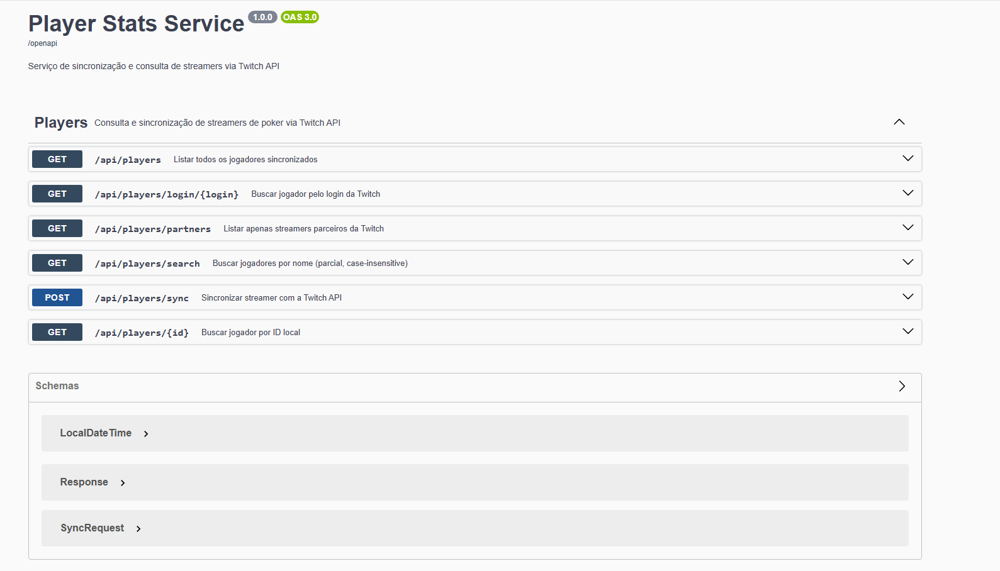

# Player Stats Service

Microsserviço em Quarkus para sincronização e consulta de dados de streamers de poker via Twitch API. Complementa o [PokerStream](https://www.pokerstream.pro) com um backend de dados persistente.

---

## Links rápidos

| | |
|---|---|
| Swagger UI | `http://localhost:8083/q/swagger-ui` |
| OpenAPI JSON | `http://localhost:8083/q/openapi` |
| Health check | `http://localhost:8083/q/health` |
| Rodar com Docker | [Ir para seção](#execução) |
| Rodar localmente | [Ir para seção](#modo-de-desenvolvimento) |

---

## Principais funcionalidades

- Sincronização de dados de streamers via Twitch API (OAuth2 + REST)
- Persistência em PostgreSQL para consultas offline sem depender da API externa
- Integração com API externa via MicroProfile REST Client (interface declarativa)
- Cache de token OAuth2 em memória para otimização de chamadas e respeito ao rate limit
- Idempotência no sync — chamadas repetidas atualizam sem duplicar
- Health check automático para monitoramento e orquestração com Kubernetes
- Documentação interativa com Swagger UI
- Containerização com Docker Compose

---

## Decisões de arquitetura

**Quarkus no lugar do Spring Boot**
O Quarkus processa injeção de dependência, proxies e configuração em tempo de build — não em runtime. Isso reduz o uso de memória e o tempo de startup drasticamente. Com GraalVM native image, o serviço sobe em menos de 100ms e consome ~50MB de RAM. Para ambientes Kubernetes com scaling horizontal, isso é uma vantagem concreta.

**Persistência local para dados externos**
Sem o banco local, cada consulta dependeria da disponibilidade e do rate limit da Twitch API. A estratégia adotada foi: sincronizar sob demanda via `/sync` e servir todas as consultas do banco local. O endpoint `/api/players` nunca toca a Twitch.

**Separação entre client e service**
`TwitchClient` e `TwitchAuthClient` são responsáveis exclusivamente pelo contrato com a API externa. O `PlayerService` não conhece detalhes HTTP — recebe os dados já desserializados e aplica a lógica de negócio. Isso isola o impacto de mudanças no contrato da Twitch.

---

## Onde esse projeto se destaca

- Vagas que citam **Quarkus** ou **MicroProfile**
- Vagas com **integração de APIs externas**
- Sistemas que precisam lidar com **rate limit** de provedores externos
- Ambientes **cloud-native** com Kubernetes e containers leves
- Projetos com dados de **terceiros** que precisam de persistência local

---

## Tecnologias

| Tecnologia | Versão |
|---|---|
| Java | 17 |
| Quarkus | 3.8.3 |
| RESTEasy Reactive | 3.x |
| MicroProfile REST Client | 3.x |
| SmallRye OpenAPI | 3.x |
| SmallRye Health | 3.x |
| Hibernate ORM + Panache | 3.x |
| PostgreSQL | 15 |
| Docker + Docker Compose | — |
| JUnit 5 + RestAssured | — |

---

## Diferenças em relação ao Spring Boot

| Conceito | Spring Boot | Quarkus |
|---|---|---|
| Endpoints REST | `@RestController` + `@GetMapping` | `@Path` + `@GET` (JAX-RS) |
| Injeção de dependência | `@Autowired` / construtor | `@Inject` (CDI) |
| Cliente HTTP externo | `RestTemplate` / `WebClient` | MicroProfile REST Client |
| ORM | Spring Data JPA | Panache ORM |
| Tratamento de erros | `@RestControllerAdvice` | `ExceptionMapper` + `@Provider` |
| Testes | `@SpringBootTest` | `@QuarkusTest` |
| OpenAPI | springdoc-openapi | SmallRye OpenAPI |

---

## Arquitetura

```
src/main/java/com/leonlima/playerstats/
├── resource/      → Endpoints JAX-RS (PlayerResource)
├── service/       → Lógica de negócio, cache de token, upsert
├── repository/    → Acesso a dados via Panache Repository
├── model/         → Entidade Player (Panache Active Record)
├── dto/           → DTOs de entrada, saída e contrato da Twitch API
├── client/        → MicroProfile REST Client (TwitchClient, TwitchAuthClient)
└── exception/     → ExceptionMapper para erros padronizados
```

---

## Cache de token OAuth2

A Twitch API exige autenticação OAuth2 em todas as chamadas. Obter um novo token a cada requisição adicionaria latência e consumiria desnecessariamente o rate limit.

O `PlayerService` mantém o token em cache com controle de expiração:

```java
if (cachedToken != null && LocalDateTime.now().isBefore(tokenExpiresAt)) {
    return cachedToken; // reutiliza sem chamada HTTP
}
// solicita novo token apenas quando expirado
```

O token da Twitch tem validade de ~60 dias. Subtrai-se 60 segundos como margem de segurança.

---

## Idempotência no sync

Chamar `/api/players/sync` múltiplas vezes com o mesmo login não gera duplicatas. O service usa `twitchId` como chave de upsert:

```java
Player player = playerRepository.findByTwitchId(userData.getId())
        .orElse(new Player()); // cria novo ou reutiliza o existente

player.setDisplayName(userData.getDisplayName()); // atualiza campos
playerRepository.persist(player); // INSERT ou UPDATE
```

---

## Mapeamento Twitch API → modelo local

A resposta da Twitch usa snake_case. O mapeamento para o modelo de domínio é feito via `@JsonProperty`:

```
broadcaster_type  →  Player.BroadcasterType (enum: PARTNER, AFFILIATE, NONE)
profile_image_url →  Player.profileImageUrl
view_count        →  Player.viewCount
```

O campo `broadcaster_type` chega como string e é convertido para enum pelo `parseBroadcasterType()`. Mudanças no contrato da Twitch afetam apenas os DTOs, sem impacto no restante do domínio.

---

## Timeout e resiliência

Timeouts configurados para evitar travamentos quando a Twitch API estiver lenta:

```properties
quarkus.rest-client.twitch-api.connect-timeout=5000   # 5s
quarkus.rest-client.twitch-api.read-timeout=10000     # 10s
```

Se a Twitch retornar erro, o service lança `TwitchIntegrationException`, que o `GlobalExceptionMapper` converte em `502 Bad Gateway`.

**Melhorias previstas para produção:**
- `@Retry` com backoff exponencial (MicroProfile Fault Tolerance)
- `@CircuitBreaker` para evitar chamadas em cascata quando a Twitch estiver fora
- `@Fallback` para retornar dados locais quando a API externa estiver indisponível

---

## Pré-requisitos

- Java 17+
- Maven 3.8+
- Docker Desktop
- Credenciais da Twitch API (gratuitas em [dev.twitch.tv](https://dev.twitch.tv))

---

## Configuração

### Obter credenciais da Twitch

1. Acesse [dev.twitch.tv/console](https://dev.twitch.tv/console)
2. Clique em "Register Your Application"
3. Preencha o nome e coloque `http://localhost` como redirect URL
4. Copie o **Client ID** e gere um **Client Secret**

### Configurar credenciais

Crie um arquivo `.env` na raiz do projeto:

```env
TWITCH_CLIENT_ID=seu_client_id
TWITCH_CLIENT_SECRET=seu_client_secret
```

---

## Execução

### Com Docker Compose

```bash
docker-compose up --build
```

### Modo de desenvolvimento

```bash
mvn quarkus:dev
```

Live reload automático — sem reiniciar o servidor a cada alteração.

API disponível em `http://localhost:8083`.

---

## Documentação interativa

Acesse o Swagger UI em **http://localhost:8083/q/swagger-ui**

<!-- Substitua pela sua captura de tela -->
<!--  -->

---

## Testes

```bash
mvn test
```

`@QuarkusTest` sobe a aplicação completa com banco H2 em memória. O RestAssured faz requisições HTTP reais contra a aplicação — sem mocks, sem dependência de PostgreSQL ou Twitch API reais.

---

## Endpoints

| Método | Rota | Descrição |
|--------|------|-----------|
| POST | `/api/players/sync` | Sincronizar streamer com a Twitch API |
| GET | `/api/players` | Listar todos os jogadores |
| GET | `/api/players/{id}` | Buscar por ID |
| GET | `/api/players/login/{login}` | Buscar pelo login da Twitch |
| GET | `/api/players/search?name=` | Buscar por nome |
| GET | `/api/players/partners` | Listar apenas parceiros Twitch |
| GET | `/q/health` | Health check |
| GET | `/q/swagger-ui` | Documentação interativa |
| GET | `/q/openapi` | Especificação OpenAPI 3 |

---

## Exemplos

### Sincronizar um streamer

```bash
curl -X POST http://localhost:8083/api/players/sync \
  -H "Content-Type: application/json" \
  -d '{"login": "galflipper"}'
```

```json
{
  "id": 1,
  "twitchId": "47839628",
  "displayName": "galflipper",
  "login": "galflipper",
  "profileImageUrl": "https://static-cdn.jtvnw.net/...",
  "description": "Poker player and streamer",
  "viewCount": 8500000,
  "broadcasterType": "PARTNER",
  "lastSyncAt": "2025-01-01T10:00:00",
  "createdAt": "2025-01-01T10:00:00"
}
```

### Buscar por nome

```bash
curl "http://localhost:8083/api/players/search?name=poker"
```

---

## Relação com o PokerStream

Este serviço foi projetado para complementar o [PokerStream](https://www.pokerstream.pro):
- O PokerStream consulta a Twitch API diretamente no front-end via Next.js
- Este serviço persiste e centraliza os dados dos streamers no backend
- Permite consultas offline, histórico e ranking sem depender do rate limit da Twitch

---

## Autor

**LNL**
GitHub: [@leonlimask20-dot](https://github.com/leonlimask20-dot)
Email: leonlimask@gmail.com
